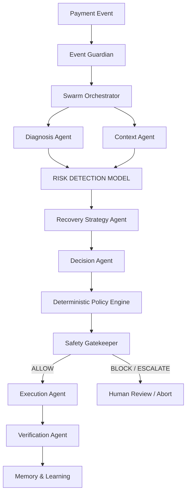

# PAYVISHWAS Architecture

PAYVISHWAS uses a multi-agent architecture combined with deterministic financial policies and a dedicated Risk Evaluation ML model (Track 02 requirement).

## System Flow

The core system handles incoming payment events (e.g., `payment.failed`) through a strict pipeline:

## Component Roles

### 1. Event Guardian
Securely receives and validates incoming payment events (e.g., Razorpay webhooks). Handles idempotency, prevents replays, and creates the initial audit record.

### 2. Diagnosis Agent
Determines the root cause of the failure based on bank/gateway responses, error codes, and system signals (e.g., temporary bank timeout vs. insufficient funds).

### 3. Context Agent
Builds a comprehensive profile around the event using customer history, merchant policies, and real-time transaction data. Minimizes PII exposure to downstream LLMs.

### 4. Risk Detection Model (Track 02 Primary Evaluated Component)
A measurable Machine Learning model (or statistical heuristic for demo purposes) that predicts the financial loss risk (specifically Fraud/Chargeback Risk). 
- **Input**: Amount, method, failure type, frequency, customer/merchant history, velocity.
- **Output**: Risk Score, Risk Level (LOW, MEDIUM, HIGH, CRITICAL), Confidence, Expected Outcome.

### 5. Recovery Strategy Agent
Generates multiple candidate actions (e.g., Immediate Retry, Delayed Retry, Payment Link, Recommend Alternate Method) along with expected recovery probability and cost.

### 6. Decision Agent
Ranks and selects the optimal recovery strategy based on the Risk Model's output and the Context Agent's data.

### 7. Deterministic Policy Engine
Applies strict, non-AI rules (e.g., `Max Retry = 2`, `Automatic Recovery Limit = ₹25,000`). This ensures that the AI cannot hallucinate a financially unsafe action.

### 8. Safety Gatekeeper
The final checkpoint. It independently verifies the action against the Policy Engine and Risk Thresholds. Produces a final result: `ALLOW`, `BLOCK`, or `ESCALATE`. AI cannot bypass this layer.

### 9. Execution & Verification Agents
The Execution Agent performs the API calls to the payment gateway (Razorpay). The Verification Agent reconciles the actual state (to handle timeouts or unknown states).

## Tech Stack
- **Frontend**: Next.js (React, TypeScript), Tailwind CSS, shadcn/ui.
- **Backend**: Python (FastAPI).
- **Database**: PostgreSQL (SQLAlchemy) & Redis (for idempotency and caching).
- **ML / AI**: Track-02 Risk Model (scikit-learn / stats) + Anthropic/OpenAI SDKs for LLM reasoning.
